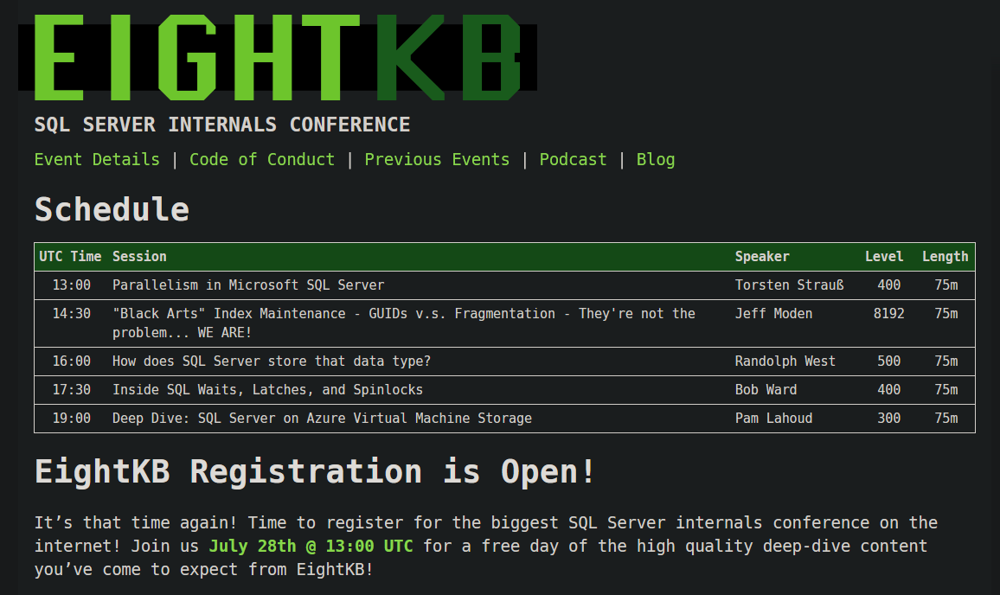

# SQL Server on AKS - Proof of Concept

---

## Andrew Pruski

### SQL Server DBA, Microsoft Data Platform MVP, & Certified Kubernetes Administrator
<!-- .slide: style="text-align: left;"> -->
<i class="fab fa-twitter"></i><a href="https://twitter.com/dbafromthecold">  @dbafromthecold</a> 
<i class="fas fa-envelope"></i>  dbafromthecold@gmail.com 
<i class="fab fa-wordpress"></i>  www.dbafromthecold.com 
<i class="fab fa-github"></i><a href="https://github.com/dbafromthecold">  github.com/dbafromthecold.com</a>

---

---

## Session Aim
<!-- .slide: style="text-align: left;"> -->
To go through how we approached testing running SQL Server in Azure Kubernetes Services

---

## Running the Kubernetes cluster
<!-- .slide: style="text-align: left;"> -->
- On-premises vs Cloud 
- Node size and configuration 
- On-going maintenance? 
- Skillset

---

## Deploying SQL Server
<!-- .slide: style="text-align: left;"> -->
- Private registry vs MCR 
- Deployments vs Statefulsets 
- Helm Charts

---

## Other considerations
<!-- .slide: style="text-align: left;"> -->
- AKS configuration - Node Pools & Availability Zones
- Disaster Recovery 
- Performance 
- Security

---

## High availability
<!-- .slide: style="text-align: left;"> -->
- Using the built-in Kubernetes features 
- SQL Server high availability features unavailable 
- Pod recovery 
- Node recovery

---

# Demos

---

## Resources
<!-- .slide: style="text-align: left;"> -->

<a href="https://github.com/dbafromthecold/sqlserverakspoc">https://github.com/dbafromthecold/sqlserverakspoc</a> 
<a href="http://tinyurl.com/y3x29t3j/summary-of-my-container-series">http://shortlink/summary-of-my-container-series</a> 
<a href="https://portworx.com/">https://portworx.com</a> 
<a href="https://docs.microsoft.com/en-us/azure/azure-arc/data/managed-instance-overview">https://shortlink/managed-instance-overview</a>

